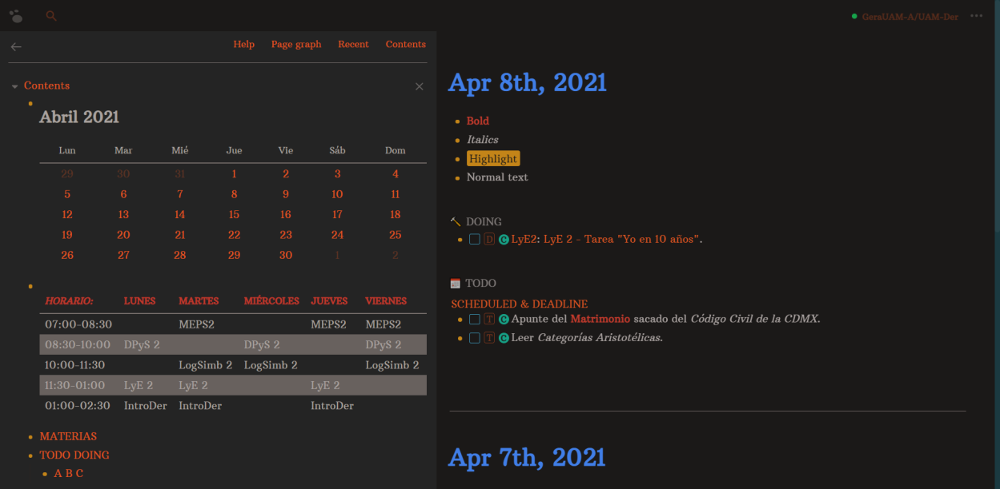
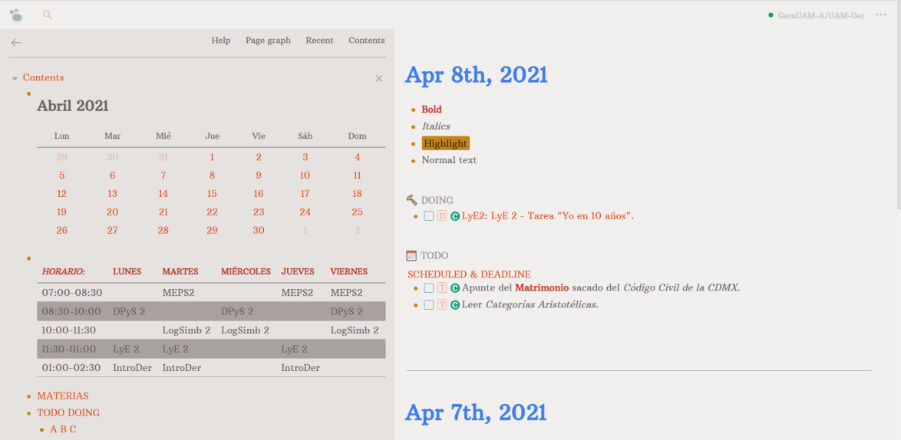

# Logseq Base16 Atelier Forest by Denaro
Logseq theme based on "Base16 Atelier Forest" special thanks no Nikdoof

## Install

Copy ``@import url('https://raw.githack.com/DenaroCF/LS-Base16-Atelier-Forest-by-Denaro/main/custom.css');`` into yor custom.css file (you can find this file inside of Logseq``

### Demo

- **Dark Mode**

- **Light Mode**

