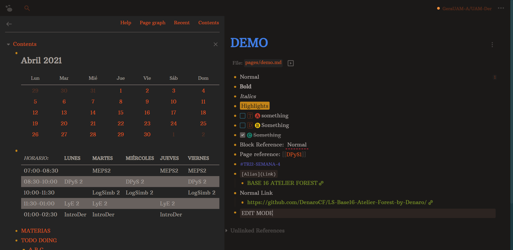

# Logseq Base16 Atelier Forest by Denaro
Logseq theme based on "Base16 Atelier Forest". Special thanks to [Nikdoof](https://twitter.com/nikdoof_?s=20) and [Chris Ruzin](https://twitter.com/nizur?s=20)

_**You can find how to install the theme at the end of the text.**_

## Demo

- **Dark Mode**


- **Light Mode**


## Install

Copy
```css
@import url('https://raw.githack.com/DenaroCF/LS-Base16-Atelier-Forest-by-Denaro/main/custom.css');
``` 
into your _custom.css_ file (you can find this file inside of Logseq)
